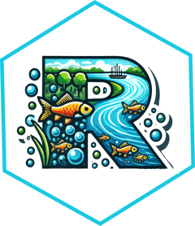

# danubeoccurR

<!-- badges: start -->
<!-- badges: end -->

# danubeoccurR 

A short description of what your package does and how it helps users.

## Installation

You can install the development version of `yourPackageName` from GitHub using the `remotes` package.

First, ensure you have `remotes` installed:

```r
install.packages("remotes")

remotes::install_github("yourusername/yourPackageName")
remotes::install_github("AnthonyBasooma/specleanr")


#### 3. Usage Example

Provide some simple examples of how users can use your package. This could include how to check species names using the function you developed:

```markdown
## Usage

Here's how to use the `check_species_name` function to validate species names.

```r
# Load your package
library(yourPackageName)

# Example data
data <- data.frame(species = c("Salmo salar", "Oncorhynchus mykiss"))

# Call the function
result <- check_species_name(data, col_species_name = "species", target_accuracy = 95)

# View the result
print(result)


#### 4. License

You can include a section on the license under which your package is distributed. For example:

```markdown
## License

This package is licensed under the MIT License.

## Acknowledgments

This project was funded by the IUCN and benefited from the collaboration of [Your Collaborators or Institutions].
