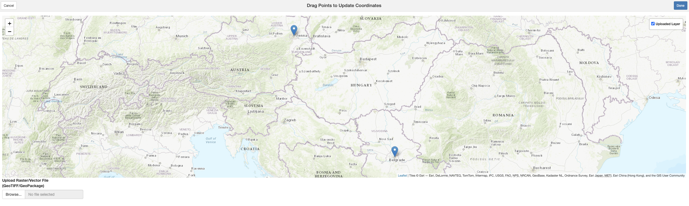

```{r, include = FALSE}
knitr::opts_chunk$set(
  collapse = TRUE,
  comment = "#>"
)
```

```{r setup, echo=FALSE, message=FALSE, warning=FALSE}
library(danubeoccurR)
library(dplyr)
```

## Introduction

Georeferencing errors are a common issue in biodiversity datasets, potentially 
affecting ecological analyses and conservation decisions. The `danubeocurR` 
package provides an interactive tool to manually correct occurrence records with
incorrect spatial coordinates. This vignette demonstrates how to launch and use 
the interactive application to adjust occurrence points, ensuring accurate 
spatial representation.

By using this tool, users can visually inspect and move points to their correct 
locations on a map, improving the quality and reliability of occurrence data. 
This functionality is particularly useful when dealing with historical records, 
ambiguous locality descriptions, or systematic errors in coordinate assignment.

In the following sections, we will walk through the steps to launch the 
application, load occurrence data, and manually correct erroneous points before
saving the updated dataset.

## Step 1: Install the Package from GitHub

To get started, you need to install the danubeoccurR
package from GitHub. You can do this using the devtools package:
```{r, eval=FALSE}
# Install the devtools package if you haven't already
install.packages("devtools")

# Install the danubeoccurR package from GitHub
devtools::install_github("ytorres-cambas/danubeoccurR")
library(danubeoccurR)
library(dplyr)
```

## Step 2: Prepare a dataframe with coordinates

In this step, we create a dataframe containing point coordinates that need to be
corrected. The dataframe includes unique IDs and latitude/longitude values for 
two locations, Vienna and Belgrade. The snap_points_on_map() function is then 
used to align these points to the correct locations on the map.

```{r, eval=FALSE}
coords <- data.frame(id = 1:2, 
                     lat = c(48.2082, 44.8176),   # Vienna, Belgrade
                     lng = c(16.3738, 20.4633))    # Vienna, Belgrade 
updated_coords <- snap_points_on_map(coords)
```

## Step 3: Launch the app and snap points manually

To manually adjust the coordinates, we use a Shiny app that enables interactive point correction. The app allows users to drag and drop points to their desired locations on the map. Once adjustments are made, clicking the 'Done' button saves the updated coordinates.

Below is a screenshot of the app interface, where points can be manually moved to their correct positions:

<div style="max-width:100%; height:auto; overflow:auto; border:1px solid #ccc; padding:5px;">
  
</div>


## Step 4: Visualize dataframe with original and updated coordinates

After adjusting the points in the Shiny app, the modified coordinates are stored in the updated_coords dataframe. This dataframe contains additional columns, new_lat and new_lng, which represent the corrected latitude and longitude values.

```{r, eval=FALSE}
# Display dataframe with original and updated coordinates
print(updated_coords)
```

This ensures that all points are properly aligned with their intended locations, improving data accuracy for downstream analyses.
